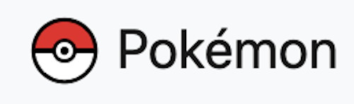
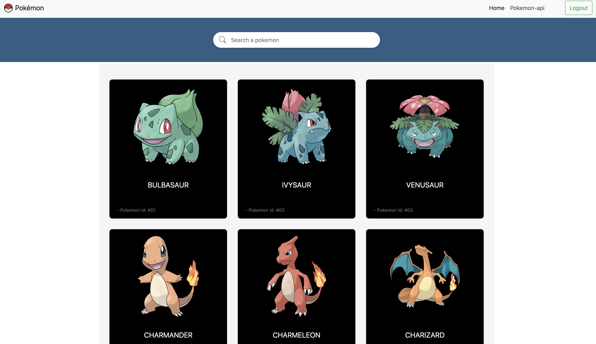

# Description

This project using angular and PokeApi to fetch the data.

# ScreenShot



# Demo

To get the demo click of the website click here : [pokemon-api](https://batouche-dev.github.io/budget/) .

# Setup

first clone the project in your workspace with this command line

```
git clone https://github.com/batouche-dev/pokemon-api.git
```

# Launch

```
cd pokemon-api
```

and then open using `ng serve` command line and open it with any browser: chrome, firefox, safari ... 

